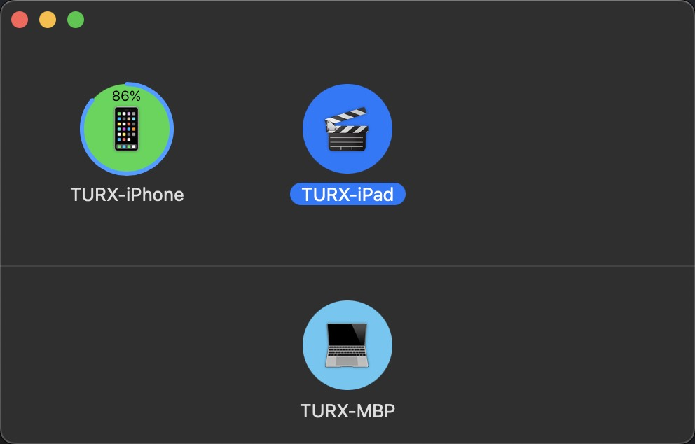

# Repository of KDE Connect macOS

This project is the macOS version of the group of applications called KDE Connect, which uses the LAN network to integrate devices together. For information on KDE Connect, check out:

- [The KDE Community Wiki](https://community.kde.org/KDEConnect)
- [The KDE UserBase Wiki](https://userbase.kde.org/KDEConnect)

This project is based on iOS codebase ([kdeconnect-ios d24e5ca5ebb1ae446de8eeab5f2d619e46fbd996](https://invent.kde.org/network/kdeconnect-ios/-/tree/d24e5ca5ebb1ae446de8eeab5f2d619e46fbd996)). Compatibility with iOS is preserved at the maximum effort.

If you would like to talk to the KDE Connect developers & contributors (for questions or if you would like to contribute!), please join the [KDE Connect development Telegram channel](https://t.me/joinchat/AOS6gA37orb2dZCLhqbZjg).

### Beta Testing

You can get the public testing version of KDE Connect macOS by opening [this TestFlight link](https://testflight.apple.com/join/vxCluwBF) (same link as KDE Connect iOS).

This version supports running on Macs with Apple Silicon and Intel Chip.

### Features

- Device List, Discovery, and Pairing
- Ping
- Battery Status
- Clipboard: Push & Receive Text
- Share: Send and Receive File
- Settings

## Contributing

Contributions including bugs, feature requests, and merge requests are highly welcomed. To get started, you might find the following information helpful.

We keep track of tasks for KDE Connect macOS using [Phabricator](https://phabricator.kde.org/project/board/159/) and the following [Tasks](#tasks) section, and accept changes through KDE Invent GitLab [merge requests](https://invent.kde.org/ruixuantu/kdeconnect-mac/-/merge_requests).

### Bug Reporting

Please feel free to give feedback about/report bugs in the TestFlight version through:

- **System Preferences app:** you can report general information such as the number of app launches and crashes by enabling System Preferences > Security & Privacy > Analytics & Improvements > Share with App Developers option
- **TestFlight's feedback:** click "Send Beta Feedback" button to send a feedback email to us
- **TestFlight's integrated crash feedback system:** upon app crashing, an alert will appear asking you if you would like to send the crash data along as feedback
- **[KDE Bugzilla](https://bugs.kde.org/enter_bug.cgi?product=kdeconnect&component=macos-application):** you may manually disclose as much or as little information as you would like, but all information will have to be investigated manually

### macOS

To compile or run this project, the latest Xcode with an Apple ID (Apple Developer Program enrollment is not necessary) is required. As Xcode can only be installed on macOS, any interested developer should have the latest macOS environment.

The best and most stable way is to purchase an Apple device with the latest macOS supported. If the interested developer has an insufficiency of funds, there are several alternative options:

- **Virtual Machine:** A convenient but not performance-optimized way, and there are many tutorials online.
- **Hackintosh:** The developer could try to run macOS with amd64 arch on their own PCs. See [OpenCore](https://dortania.github.io/OpenCore-Install-Guide/).
- **Public Devices:** The developer might visit nearby universities or public libraries to seek access to an Apple device.

### Frameworks

We are using Swift and SwiftUI for frontend, plus Swift and Objective-C for backend. Since KDE Connect macOS makes heavy use of both Swift and Objective-C and needs to keep compatibility with iOS, it can be a bit confusing at first, so feel free to ask the developers some questions.

### Tasks

Many tasks only include a high-level description and could be easily misinterpreted, so we would recommend first starting a conversation about the task you are interested in implementing with your high-level plan before diving into coding.

- **[DevicesView](https://invent.kde.org/ruixuantu/kdeconnect-mac/-/blob/master/KDE%20Connect/Views/Devices/DevicesView.swift) Layout**: We are currently using adaptive LazyVGrid. It would be better to implement an [AirDrop](https://support.apple.com/en-us/HT203106)-like window, i.e., to layout the items along the center of an arc path, and use the grid layout as a fallback when there are too many devices.
- **[PeerSettingsView](https://invent.kde.org/ruixuantu/kdeconnect-mac/-/blob/master/KDE%20Connect/Views/Settings/PeerSettingsView.swift) Editable List**: The editable list should be reimplemented, as the current list does not look or behave (e.g., Command+A not supported) like the editable list in System Preferences (e.g., WiFi).
- **[App](https://invent.kde.org/ruixuantu/kdeconnect-mac/-/blob/master/KDE%20Connect/Views/Main%20Window/App.swift) Singleton:** More than one MainView or AskNotificationView for this app should not be allowed to avoid conflicts. If we would like to let user close MainView window and keep KDE Connect macOS running in the background, we might also move backend services to App from MainView.
- **[AppDelegate](https://invent.kde.org/ruixuantu/kdeconnect-mac/-/blob/master/KDE%20Connect/Swift%20Backend/Mac/AppDelegate.swift) Menu**: We would like to remove non-necessary application menus set by the system (e.g., File, Edit, View), but we currently manually remove every time when the window updates, which might be replaced by a better approach.
- **[App](https://invent.kde.org/ruixuantu/kdeconnect-mac/-/blob/master/KDE%20Connect/Views/Main%20Window/App.swift) Notification Permission:** Like the previous task, to detect changes, we currently manually check every time when the window updates.
- **Integration:** The macOS codebase will be shared with [KDE Connect iOS](https://invent.kde.org/network/kdeconnect-ios/), either by integrating the macOS Views into iOS project, or extracting the backend and plugins from separate iOS and macOS repositories to a public repository, and rebase will be applied.
- **More Plugins Supported by iOS:** Find My Device, Presenter Control Sender, Mouse Control Sender, Run Command Sender.
- **More Features Will Also Be Supported by iOS:** Keyboard Control Sender, Trusted Networks, i18n & l10n.
- **Plugins Not Supported by iOS:** Mouse Control Receiver, Keyboard Control Receiver, Presenter Control Receiver, Run Command Receiver.
- **Multi-device Experience Extension for Remote Input**: Requires completion of Remote Control Receiver.
- **More:** New feature requests are welcomed.
